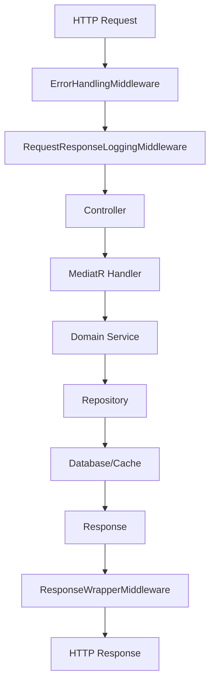
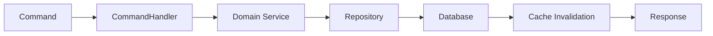
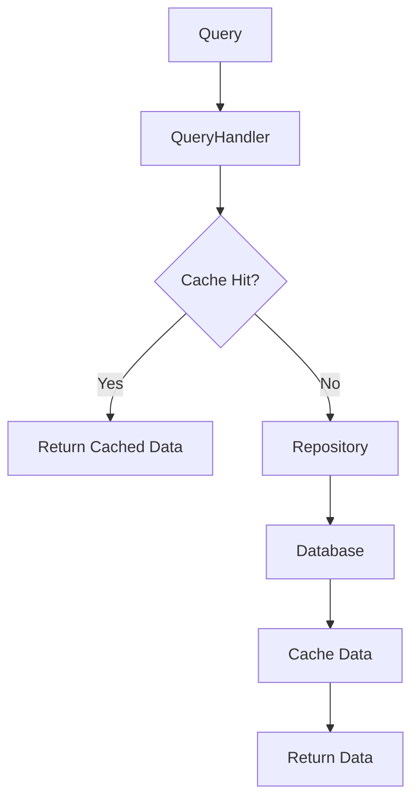
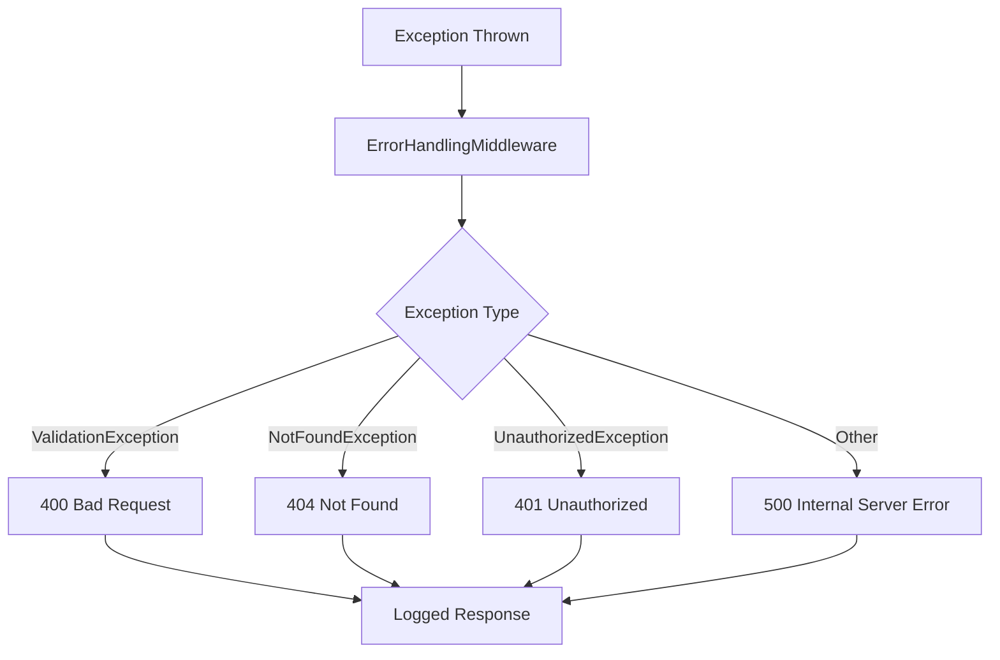
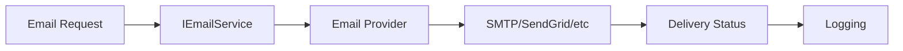
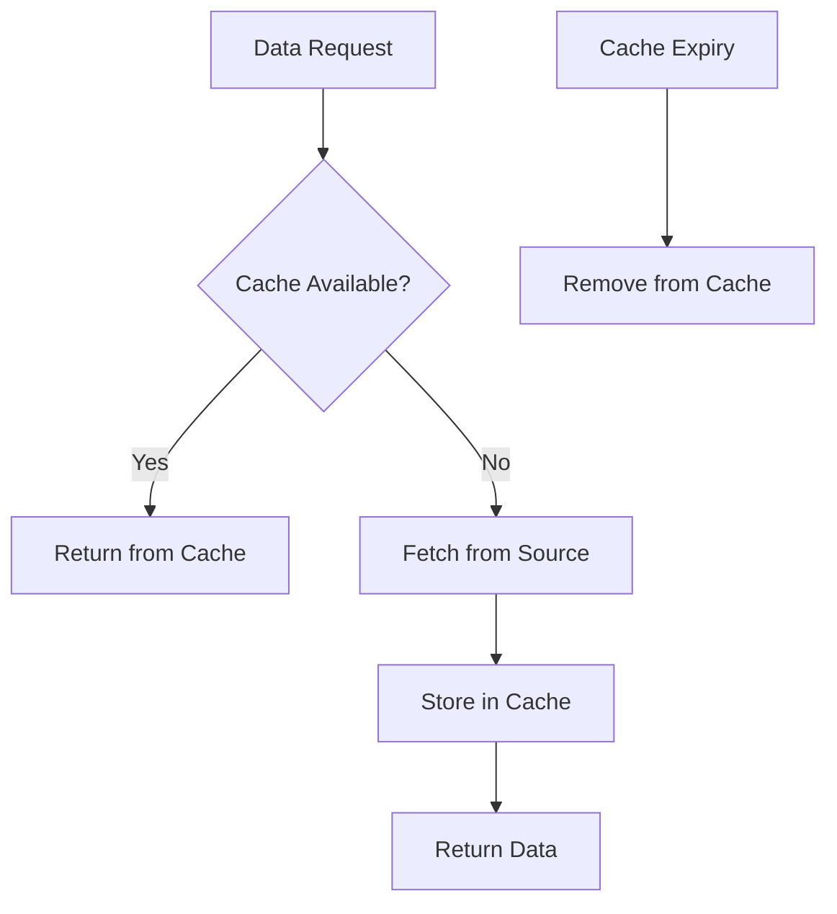
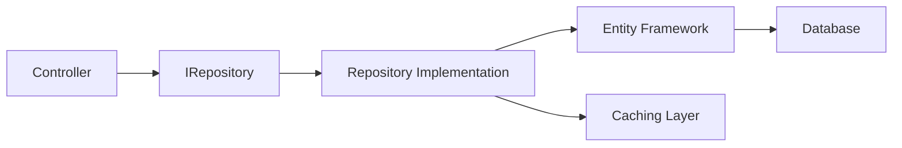

# CommonService Operational Flows

## 1. Request Processing Flow



## 2. CQRS Command Flow



## 3. Query Flow with Caching



## 4. Error Handling Flow



## 5. Service Integration Patterns

### Email Service Flow


### Caching Strategy


## 6. Repository Pattern Implementation



## Key Features:

1. **Middleware Pipeline**: Xử lý lỗi, logging, và response wrapping tự động
2. **CQRS Ready**: Sẵn sàng cho Command/Query separation với MediatR
3. **Caching Strategy**: Hỗ trợ cả In-Memory và Redis caching
4. **Repository Pattern**: Abstraction layer cho data access
5. **Clean Architecture**: Tách biệt rõ ràng các concerns
6. **Service Integration**: Email, SMS, Payment services
7. **Error Handling**: Centralized exception handling
8. **API Documentation**: Swagger/OpenAPI integration

## Usage Examples:

### 1. Adding a new Command
```csharp
public class CreateCustomerCommand : IRequest<Customer>
{
    public string PhoneNumber { get; set; } = string.Empty;
}

public class CreateCustomerCommandHandler : IRequestHandler<CreateCustomerCommand, Customer>
{
    private readonly ICustomerRepository _repository;
    
    public CreateCustomerCommandHandler(ICustomerRepository repository)
    {
        _repository = repository;
    }
    
    public async Task<Customer> Handle(CreateCustomerCommand request, CancellationToken cancellationToken)
    {
        var customer = new Customer { PhoneNumber = request.PhoneNumber };
        await _repository.AddAsync(customer, cancellationToken);
        return customer;
    }
}
```

### 2. Using Cache Service
```csharp
public class CustomerService
{
    private readonly ICacheService _cache;
    private readonly ICustomerRepository _repository;
    
    public async Task<Customer?> GetCustomerAsync(int id, CancellationToken ct)
    {
        var cacheKey = $"customer_{id}";
        var cached = await _cache.GetAsync<Customer>(cacheKey);
        
        if (cached != null)
            return cached;
            
        var customer = await _repository.GetByIdAsync(id, ct);
        if (customer != null)
            await _cache.SetAsync(cacheKey, customer, TimeSpan.FromMinutes(30));
        
        return customer;
    }
}
```